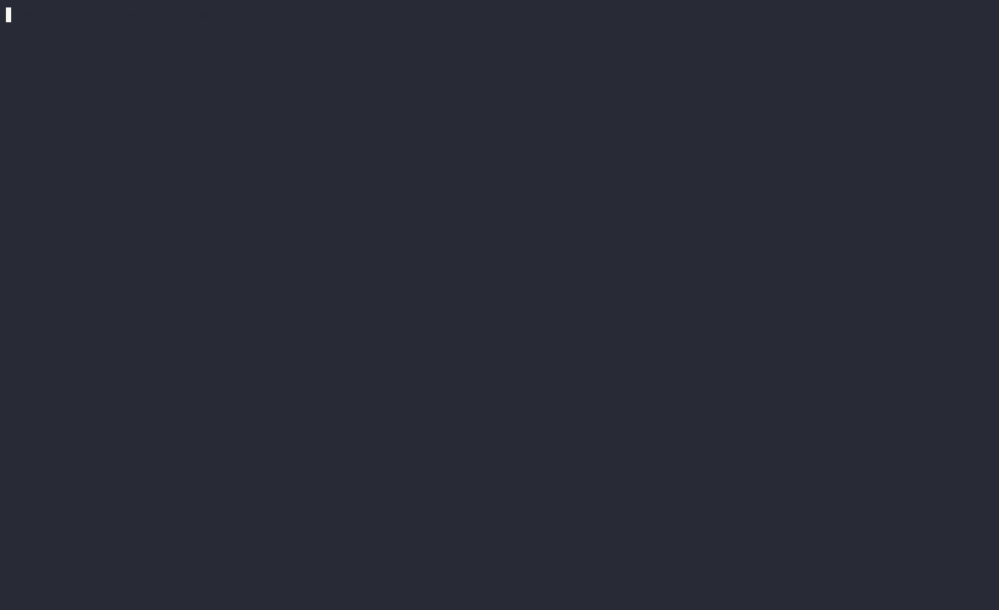

[](https://github.com/NijiDigital/space-invaders-ascii-nodejs/actions/workflows/build.yaml)

## Space Invaders

A space invaders game in ASCII art made with love, NodeJS and TypeScript.



### Getting started

Run the game:

```shell
npm start
```

For a better keyboard experience, on Linux, use:

```shell
bin/start
```

Run in production mode:

- First build the project:

    ```shell
    npm run clean
    npm run build
    ```

- Then start the game:

    ```shell
    npm run start:production
    ```

- For a better keyboard experience, on Linux:

    ```shell
    NODE_ENV=production bin/start
    ```

Enjoy!

### References

- https://fr.wikipedia.org/wiki/Space_Invaders
- https://github.com/ghaiklor/terminal-canvas
- https://github.com/macdice/ascii-invaders/blob/master/invaders.c
- https://github.com/Grieverheart/space_invaders/blob/8af7bd8336fb08342e5c53090ff3a6aac0af48c6/main.cpp
